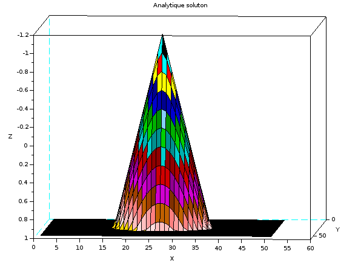

# front-end-propagation
Simulation of front-end propagation
# Overview

This projet aims to solve the problem of front-end propagation, which could be modeled by the following partial differential equation called $Eikonal Equation$ $$w_t(t, x, y)+F(x, y)||\Delta_{x}w(t, x, y)||^2=0, w(0, x, y)=\phi{(x, y)}$$

The equation coule be solved in the filed of calculation $$D=[a, b]*[c, d]$$

for $t\in[0, T]$ with a time horizon given. The spatials variables $(x, y)$ will be discretized using a regular grid $$G(n_{x}), n_{y}={(x_{i}, y_{j}), i=0,\cdots,n_{x}-1, j=0,\cdots,n_{y}-1}$$ with $$x_{i}=a+ih_{x}, y_{j}=c+jh_{y}, h_{x}=\frac{b-a}{n_{x}}, h_{y}=\frac{d-c}{n_{y}}$$ we noted $h=(h_{x}, h_{y})$ a step of grid. The tme variable $t$ will be discretized with a step $\Delta{t}>0$. We note $$w^{n}_{i, j}\approx w(t_{n},x_{i}, y_{j})$$ the solution approximized.

# Model

Model 1. $$F(x, y)=1.0, D=[-5, 5]*[-5, 5], T=0.6$$ Initial condition: $$\phi(x, y)=min(1.0, \sqrt{x^{2}+y^{2}}-0.5)$$ Analytical solution: $$w(t, x, y)=min(1.0, \sqrt{x^{2}+y^{2}}-0.5-t)$$ Grid: $$(n_{x}, n_{y})=(50, 50)$$

Model 2. $$F(x, y)=1.0, D=[-5, 5]*[-5, 5], T=0.6$$ Initial condition: $$\phi(x, y)=min(1.0, max(\sqrt{(x^{2}+1.0)^{2}+y^{2}}-0.5, \sqrt{(x^{2}-1.0)^{2}+y^{2}}-0.5))$$ Analytical solution: $$\phi(x, y)=min(1.0, max(\sqrt{(x^{2}+1.0)^{2}+y^{2}}-0.5-t, \sqrt{(x^{2}-1.0)^{2}+y^{2}}-0.5-t))$$ Grid: $$(n_{x}, n_{y})=(50, 50)$$

# Requirement

Python 3.7 NumPy 1.15.4

# Usages

To run this script, you should follow below command:

'''
python main.py --model option(model_1 or model_2) --method option(method_1 or method_2)
'''

# Visualization

